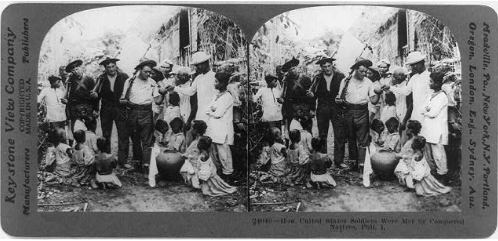

## Colonization/Decolonization

[^1]

This course examines the processes of colonization and decolonization that define the making of a modern, integrated world (c. 1500 to the present). We will study primary source materials.  We focus on the instruments of colonization—the treaty, the charter, the map, the ethnology—and the engines of decolonization—the manifesto, the resistance, the solidarity with the colonial, the demand for self rule. We are interested in the processes and contents of social and cultural contact and exchange, the development of knowledge, and how they shape relations of power; the place of colonialism in the development of western capitalism; and the elements of colonial power and resistance, including ideologies of liberal political philosophy, social Darwinism, and nationalism.  

We will consider how ideas about race, civilization, religion, self and other, and freedom have evolved over time and shaped the making of the modern world. We will also incorporate, as much as possible, the history of New York City and of Columbia in our readings.  Those who want to know more about Columbia’s history are encouraged to visit the website of the Columbia University [Historical Justice Initiative](https://www.cuhistorytour.com). Class is held as a discussion seminar based on close reading of primary-source documents, literature, film, and music.

**Land Acknowledgment:** As members of Columbia’s Morningside campus, we acknowledge that we are on the territory of the Lenape and Wappinger peoples.  Many indigenous communities have lived in and moved through this place over time.  Indigenous people from many nations live and work in this region today.  We acknowledge their communities by paying respect to their elders past and present, and recognizing their active presence and their futurity, reposed in the generations present and those to come.

**Academic Integrity:** Cheating and plagiarism will not be tolerated under any circumstances.  Should students have any question as to what constitutes appropriate academic behavior, they are encouraged to consult with the professor and to revisit the Faculty Statement on Academic Integrity, available [on-line](https://www.college.columbia.edu/academics/integrity-statement) Any breach of this intellectual responsibility is a breach of faith with the rest of our academic community. It undermines our shared intellectual culture, and it cannot be tolerated. Students failing to meet these responsibilities should anticipate being asked to leave Columbia.

**Assessments:** We want to build a community of readers and thinkers in this class - who are able to work collectively and collaboratively. I am setting my assessment goals on two paths: firstly, I want to make sure we are doing close-reading of the texts, and secondly, I want to ensure that we are critical and engaged writers. With those goals, I ask that you do two forms of regular production in the class - short form writing and research oriented presentation.

* 20 points for Participation: To get the full points, you will attend every single class, and be an active listener to your colleagues, and sometimes, a commenter and facilitator for their ideas and sometimes, a speaker of your own thoughts.
* 10 points for Digital Archive Report on either of the three: 1) [Museum of Chinese in America NYC](https://www.mocanyc.org/) or [South Asian American Digital Archive](https://www.saada.org/) or [NYPL Schomburg Digital Collections](https://www.nypl.org/about/locations/schomburg/digital-schomburg/online-exhibitions)
* 25 points for Presentations on Context/Time: Every class, one student will deliver a short-presentation on the context for the [starred] Text/Author we are reading. This context will comprise of 10 headlines (only) selected from newspapers contemporary to the Text/Author. You can use the Historical Newspaper databases on Clio. This presentation will be posted on Piazza before the class begins. Expect to invest around 15 hours of research, writing and prepration for this presentation. The presentation cannot last more than 15 minutes.
* 15 points for Discussion on CW: For your comment/discussions on the CW posts of your colleagues after the class.
* 30 points for putting together and participating on a Conference on Decolonization 2020.

## Course Timeline

**Sept. 9: What is Colonization? What is Decolonization?**
* W.E.B. DuBois, “The Disfranchised Colonies,” in *Color and Democracy: Colonies and Peace* (New York: Harcourt, Brace and Company, 1945), pp. 17-26.
* Aimé Césaire, *Discourse on Colonialism* (New York: Monthly Review Press, 2000), 31-46
* Suzanne Césaire, "The Malaise of Civilization" (1943)
* Ranajit Guha, “A Conquest Foretold” (1998)
* Achille Mbembe, "Decolonizing Knowledge and the Question of the Archive" (2015)

**Sept. 16: We Were Always Here**
* Abu Zayd al-Sirafi, "Accounts of China and India" (ca. 9th c.)
* Ibn Fadlan, "Mission to the Volga" (ca. 10th c.)
* Letter from Mahruz to Abu Zikri Kohen, Broach (1145)
* Ma Huan, “The Overall Survey of the Ocean’s Shores” (1443)
* Ilyas Mawsili, *An Arab’s Journey to Colonial Spanish America* (ca. 1688)

**Sept. 23: The Invasions of Spain & Portugal**
* Christopher Columbus, “Letter of Columbus to Luis de Santangel” (1493) 
* Copy of a Letter of the King of Portugal Sent to the King of Castile Concerning the Voyage and Success of India (1505)
* Hernán Cortés, Second Letter from Mexico (1519), 47-160
* The Story of the Conquest as Told by the Anonymous Authors of Tlateloloco in Miguel León-Portilla, *The Broken Spears*

**Sep 30: The Permission to Steal**
* Charter of the Dutch Verenigde Oostindische Compagnie (1602)
* Charter granted by Queen Elizabeth to the East India Company (1600)
* Charter granted by Charles II to East India Company (1661)
* Charter granted to the Company of Royal Adventurers of England Relating to Trade in Africa (1663)
* John Locke, "Fundamental Constitution of Carolina" (1669)
* John Donne, "Sermon to the Company of the Virginia Plantation" (1622)

**Oct. 7: The Power to Render**
* Thomas Hariot’s A Brief and True Report of the New Found Land of Virginia (1588)
* Thomas Kitchin’s "A New Map Of Indostan or East Indies agreeable to the latest Authorities" (1770)
* Theodre De Bry’s [Engravings of 1590](https://dc.lib.unc.edu/cdm/search/collection/debry)
* John White [Engravings](http://www.virtualjamestown.org/images/white_debry_html/jamestown.html)

**Oct. 14: Enslavement and Enlightenment**
* "Voyage of the James, 1675- 1676,” and “Voyage of the Hannibal, 1693-1694,” in Stanley Engerman, Seymour Drescher, and Robert Paquette, eds. *Slavery: A Reader*
* David Hume, "On National Character" (1748)
* Immanuel Kant, "Of the Different Human Races" (1777)
* Comte de Buffon, Georges-Louis Leclerc, “Of the Varieties in the Human Species,” in *Natural History Containing A Theory Of The Earth, A General History Of Man, Of The Brute Creation, And Of Vegetables, Minerals, Etc.* (1797)

**Oct. 14: The Right to Speak**
* Ottobah Cugoano *Narrative of the Enslavement of Ottobah Cugoano, a Native of Africa; Published by Himself* (1787)
* Zora Neale Hurston, *Barracoon: The Story of the Last ‘Black Cargo’*
* Haitian Declaration (1804)
* Simón Bolivar, “The Jamaica Letter” (1815)
* Sojourner Truth "Ain’t I a Woman?" (1851)

**Oct. 21: Making Terra Nullius**
* Northwest Ordinance (1787)
* Cherokee Nation v. U.S. (1831)
* U.S. v. Rogers (1846)
* Alexander Ross, Adventures of the First Settlers on the Oregon or Columbia River: Being a Narrative of the Expedition Fitted out by John Jacob Astor (1849)
* Sarah Winnemucca, Life Among the Piutes (1882)
* Simon Pokagon, “The Red Man’s Greeting/Rebuke” (1893)

**Oct. 28: War Capitalism**
* Lin Zexu, Letter of Advice to Queen Victoria (1839)
* Treaty of Nanjing (1842)
* The I-ho-ch'uan, “Boxers demand death for all foreign devils” (1900)
* Fei Qihao on the Boxer Rebellion (1900)

**Nov. 4: US Empires**
* “Letters of Sanford B. Dole (Hawai'i) and Professor John W. Burgess (Columbia)” (1894)
* Petitions against Hawaiian Annexation (1897)
* War Department, *Charges of Cruelty, etc., to the Natives of Philippines* (1902)
* President William McKinley, “Second Annual Message,” Dec 5, 1898
* Platt Amendment (1903)

**Nov. 11: Rights for All**
* M. K. Gandhi, *Hind Swaraj* (1909)
* Sarojini Naidu, "Address to Madras Law Students" (1917) and "Emancipation of Indian Women" (1918)
* He-yin Zhen, "Feminist Manifesto" (1907)
* B. R. Ambedkar *Annihilation of Caste* (1936)

**Nov 18: Decolonization Engine I**
* C.L.R. James, *History of Pan-African Revolt* (1938)
* Franz Fanon, *Wretched of the Earth* (1961)
* Zohra Drif, *Inside the Battle of Algiers* (1961)
* Kwame Nkrumah, “I Speak of Freedom” (1961)

**Dec 2: Decolonization Engine II**
* Begum Rokayya, *Sultana’s Dream* (1908)
* W.E.B. DuBois, "The Comet" (1920)
* Zora Neale Hurston, “How It Feels to be Colored Me” (1928)
* Ya Dafu, “Sinking” (1921)
 
**Dec. 9: Decolonization Engine III**
* Malcolm X at Columbia University (1963)
* Martin Luther King Jr., “Beyond Vietnam,” Riverside Church (1967)
* Alcatraz Proclamation (1969)
* Gloria Anzaldúa, “Speaking in Tongues: A Letter To Third World Women Writers,” in *This Bridge Called My Back* (1981)
* Combahee River Collective, “A Black Feminist Statement,” in *This Bridge Called My Back* (1981)
* Cherrie Moraga, “Preface,” in *This Bridge Called My Back* (1981)

**Recommended Readings**
The following secondary books may be useful for you. They are in the CW:
* Walter Rodney, *How Europe Underdeveloped Africa* (1976)
* Edward Said, *Orientalism* (1979)
* Sidney Mintz, *Sweetness and Sugar: The Place of Sugar in Modern History* (1985)
* Sylvia Wynter, *No Humans Involved* (1992)
* V. Y. Mudimbe, *The Idea of Africa* (1994)
* Saidiya Hartman, *Lose Your Mother: A Journey Along the Atlantic Slave Route* (2007)
* Gaiutra Bahadur, *Coolie Woman: The Odyssey of Indenture* (2013)

[^1]: [How United States soldiers were met by conquered natives, Phil. I.](https://www.loc.gov/resource/cph.3b43426/)

 
