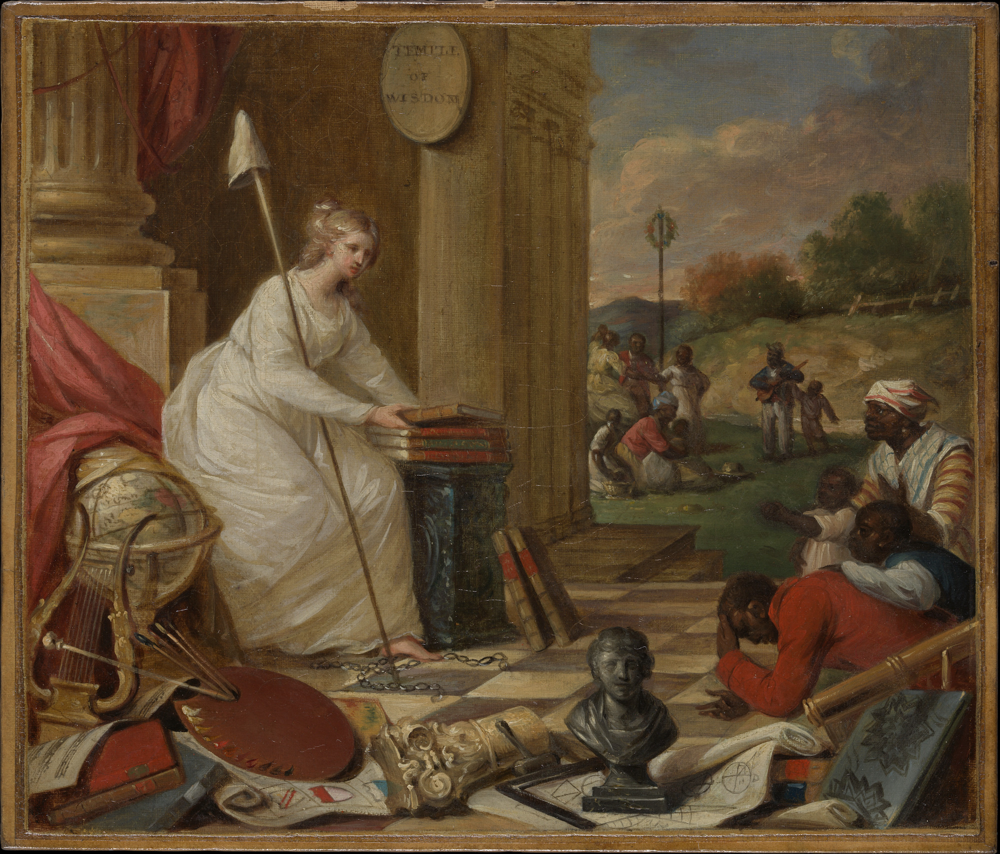

## Colonization/Decolonization: University Edition

[Photo:][Study For Liberty Displaying the Arts and Sciences, or The Genius of America Encouraging the Emancipation of the Blacks by Samuel Jennings ca. 1791–92)

This course examines the processes of colonization and decolonization that define the making of a modern, integrated world (c. 1500 to the present). We will study primary source materials.  We focus on the instruments of colonization—the treaty, the charter, the map, the ethnology—and the engines of decolonization—the manifesto, the resistance, the solidarity with the colonial, the demand for self rule. We are interested in the processes and contents of social and cultural contact and exchange, the development of knowledge, and how they shape relations of power; the place of colonialism in the development of western capitalism; and the elements of colonial power and resistance, including ideologies of liberal political philosophy, social Darwinism, and nationalism.  We will consider how ideas about race, civilization, religion, self and other, and freedom have evolved over time and shaped the making of the modern world.

In 2023-24 AY, CSER (the host unit for this course) is undergoing a push towards departmentalization. With that focus, this particular flavor of Col/Decol will focus on the site of the University, on Disciplines and on Departments and how they are implicated in (and form) colonial epistemic violence.  At Columbia University, there are several critical venues for you to familiarize yourself BEFORE the semester: Columbia University & Slavery,  Columbia 1968, (and here),  Real-Estate holdings,  Historical Justice Initiative.

Class is held as a discussion seminar and I expect every one to have *read* and *digested* the readings. Yet, I welcome you to bring all your questions, doubts, and mis-readings to the class so we can all grow in our learning together.

**Land Acknowledgment:** As members of Columbia’s Morningside campus, we acknowledge that those of us located in Manhattan are on the territory of the Lenape and Wappinger peoples.  Indigenous people from many nations live and work in this region today.  Some of us are in other parts of the American subcontinent. Many indigenous communities have lived in and moved through this place over time. I ask you to research the indigenous histories of your land and share it with our class.  Our digital infrastructure is also grounded in the same theft of land and resources under colonialism. We acknowledge  and  pay respect to the native elders past and present, and recognize their active presence and their futurity, reposed in the generations present and those to come.

**Academic integrity** is a basic understanding of our engagement in this course. I make a commitment to engage ethically and honestly with you, and I expect the same commitment. Plagiarism or dishonesty and unethical behavior is unacceptable and you will face punitive measures. You should be well-aware and actively cognizant of Columbia University's commitment to Academic Integrity. You can read the policy here. In this class, you are required to submit your original work, properly cited, for each assignment. The use of BARD, chatGPT or any other AI front-end to a LLM is prohibited. Please turn your mobile phones off when you sit down in the class. If you have any concerns, problems, issues, please talk to me. I can help. 

**Accommodations:** If you believe you may encounter barriers to the academic environment due to a documented disability or emerging health challenges, please feel free to contact the Office of Disability Services (ODS). 

**Assessments:** We want to build a community of readers and thinkers in this class - who are able to work collectively and collaboratively. I am setting my assessment goals on two paths: firstly, I want to make sure we are doing close-reading of the texts, and secondly, I want to ensure that we are critical and engaged thinkers. With those goals, I ask that you do two forms of regular production in the class - short form writing and research oriented presentation.

10%: Attendance + Participation
20%: Columbia Archives Report 
20%: Posting responses on CW Discussion (~1 per class) 
20%: Presentation on Readings (partnered assignment)
30%: Final Research Poster on one particular Columbia University Department/Unit (partnered assignment)

## CLASS TIMELINE AND READINGS

### September 5, 2023 Introductions
1. bell hooks, "Building a Teaching Community: A Dialogue," *Teaching to Transgress: Education as a Practice of Freedom* (New York: Routledge, 1994), 129-167
2. Mahmood Mamdani, "The African University" (LRB, 2018)
3. Asheesh Siddique, "Does Humanities Research Still Matter?" (IHE, 2023)
4. Noah Ramage, "Decolonizing our University, brick, tile, and mortar," *Columbia Spectator* (2017)

### Sep 12, 2023: What is Colonization? What is Decolonization? 
1. W.E.B. DuBois, “The Disfranchised Colonies,” in *Color and Democracy: Colonies and Peace* (New York: Harcourt, Brace and Company, 1945), pp. 17-26.
2. Suzanne Césaire, "The Malaise of Civilization" (1943)
3. Aimé Césaire, *Discourse on Colonialism* (1950) 31-46
4. Achille Mbembe, "Decolonizing Knowledge and the Question of the Archive" (2015)
RESPONSE 1 DUE BEFORE CLASS

### September 19, 2023 Colonizing Native Knowledges
1. Christopher Columbus,  “Letter of Columbus to Luis de Santangel” (1493)
2. Letter of the King of Portugal Sent to the King of Castile Concerning the Voyage and Success of India (1505)
3. Chimalpahin Quauhtlehuanitzin, *Annals of His Time*--1608(pgs. 106-154)

### September 19, 2023: SPECIAL LECTURE AMITAV GHOSH ON LOW FAMILY+COLUMBIA UNIVERSITY

### September 26, 2023: Colonial Possessions
1. Charter of the Dutch Verenigde Oostindische Compagnie (1602)
2. Charter granted by Queen Elizabeth to the East India Company (1600)
3. Charter granted by Charles II to East India Company (1661)
4. Charter granted to the Company of Royal Adventurers of England Relating to Trade in Africa (1663)
5. John Donne, “Sermon to the Company of the Virginia Plantation" (1622)
6. John Locke, "Fundamental Constitution of Carolina" (1669)
RESPONSE 2 DUE BEFORE CLASS

### October 3, 2023 Race and Enslavement 
1. "Voyage of the James, 1675- 1676,” and “Voyage of the Hannibal, 1693-1694,” in Stanley Engerman, Seymour Drescher, and Robert Paquette, eds. *Slavery: A Reader*
2. José Lingna Nafafé, "Mendonça’s Discourse in the Vatican: Liberation as a Wider Atlantic Question" in *Lourenço da Silva Mendonça and the Black Atlantic Abolitionist Movement in the Seventeenth Century* (323-383)
3. David Hume, "On National Character" (1748)
4.  Immanuel Kant, "Of the Different Human Races" (1777)
 Also see: https://www.rcseng.ac.uk/museums-and-archives/hunterian-museum/past-exhibitions/exhibiting-difference/exhibition/accidental-varieties
 RESPONSE 3 DUE BEFORE CLASS

### October 10, 2023 The Colonial University
1. John D. Hargreaves, "The Idea of a Colonial University," *African Affairs*, Vol. 72, No. 286 (Jan., 1973), pp. 26-36 (11 pages)
2. Thomas Babington Macalauy, "Minute, dated the 2nd February 1835" in *Islamic Studies*, Vol. 54, No. 3/4 (Autumn-Winter 2015), pp. 237-248 (12 pages)
3. Tull, Herman. “Whence Sanskrit? (Kutaḥ Saṃskṛtamiti): A Brief History of Sanskrit Pedagogy in the West.” *International Journal of Hindu Studies* 19, no. 1/2 (2015): 213–56.
4. R.H.Pratt, "The Advantages of Mingling Indians with Whites," *The Indian Policy* (1892)
RESPONSE 4 DUE BEFORE CLASS

### October 17, 2023 The Settler-Colonial University I
1. Morrill Land-Grant Act 1862
2. Morrill Act 1890
3. https://www.landgrabu.org/
4. Craig Wilder, *Ebony & Ivy* Part I (14-119)
5. Nizar A. Motani, Makerere College 1922--1940: A Study in Colonial Rule and Educational Retardation, *African Affairs*, Vol. 78, No. 312 (Jul., 1979), pp. 357-369 (13 pages)
RESPONSE 5 DUE BEFORE CLASS

### October 24, 2023 Settler-Colonial University II
1. Davarian Baldwin, *In the Shadow of the Ivory Tower: How Universities Are Plundering Our Cities* (Intro+Chp3)
2. Romita Ray,"Going Global, Staying Local: Elihu Yale the Art Collector," *Yale University Art Gallery Bulletin* (2012), pp. 34-51 (18 pages)
RESPONSE 6 DUE BEFORE CLASS

### October 31, 2023 Discipline & Department I
1. Werner J. Cahnman, "Outline of a Theory of Area Studies," *Annals of the Association of American Geographers*, Vol. 38, No. 4 (Dec., 1948), pp. 233-243 (11 pages)
2. W. Norman Brown, "South Asia Studies: A History," *The Annals of the American Academy of Political and Social Science*, Vol. 356, The Non-Western World in Higher Education (Nov., 1964), pp. 54-62 (9 pages)
3. Hossein Khosrowjah, "A Brief History of Area Studies and International Studies," *Arab Studies Quarterly*, Vol. 33, No. 3/4 (Summer/Fall 2011), pp. 131-142 (12 pages)
4. Manan Ahmed Asif, "Technologies of Power: From Area Studies to Data Science," *spheres* 2019
RESPONSE 7 DUE BEFORE CLASS

### November 7, 2023: Discipline & Department II
1. Marshall Sahlins “The Conflicts of the Faculty,” *Critical Inquiry* Volume 35, Number 4 Summer 2009
2. Beatrice Cherrier. "The Lucky Consistency of Milton Friedman’s Science and Politics, 1933–1963". In R. Van Horn, P. Mirowski, & T. Stapleford (Eds.), *Building Chicago Economics: New Perspectives on the History of America's Most Powerful Economics Program*. Cambridge: Cambridge University Press, (2011)
3. Beatrice Cherrier, "Toward a History of Economics at MIT, 1940-1972" *History of Political Economy* 1 December 2014
4. Keith Tribe. *Constructing Economic Science: The Invention of a Discipline, 1850-1950*. 3-41
RESPONSE 8 DUE BEFORE CLASS

### November 14, 2023 Discipline & Department III
1. Ann Vettikkal, "A Century Later, Columbia Excavates ‘Salvage Anthropology’" *Columbia Spectator*, April 2023.
2. Franz Boas, "The Aims of Anthropological Research Science," *New Series*, Vol. 76, No. 1983 (Dec. 30, 1932), pp. 605-613 (9 pages)
3. Garland E. Allen, "The Eugenics Record Office at Cold Spring Harbor, 1910-1940: An Essay in Institutional History," *Osiris*, Vol. 2 (1986), pp. 225-264
4. Leland L. Glenna, Margaret A. Gollnick, Stephen S. Jones, "Eugenic Opportunity Structures: Teaching Genetic Engineering at US Land-Grant Universities since 1911," *Social Studies of Science*, Vol. 37, No. 2 (Apr., 2007), pp. 281-296 (16 pages)
5. Timnit Gebru & Émile P. Torres, "Eugenics and the Promise of Utopia through Artificial General Intelligence." IEEE SaTML2023 https://www.youtube.com/watch?v=P7XT4TWLzJw&ab_channel=NicolasPapernot
RESPONSE 9 DUE BEFORE CLASS

### November 21, 2023 Discipline & Department IV
1. Robert Vitalis. *White World Order, Black Power Politics: The Birth of American International Relations*, 1-85
2. Julian Go. “Sociology’s Imperial Unconscious: The Emergence of American Sociology in the Context of Empire.” *Sociology and Empire: The Imperial Entanglements of a Discipline*, ed. George Steinmetz, Duke University Press, 2013, pp. 83–105. JSTOR, https://doi.org/10.2307/
3. Sankaran Krishna, “Race, Amnesia, and the Education of International Relations.” *Alternatives: Global, Local, Political* 26, no. 4 (2001): 401–24

### November 28, 2023 Decolonial Pedagogies
1. Paulo Friere, *Pedagogy of the Oppressed*
2. bell hooks, "Paulo Freire," *Teaching to Transgress; Education as the Practice of Freedom* (New York: Routledge, 1994), 45-59.
3. Ngugi W’o Thiango, *Decolonising the Mind* (1986) ix-34.
RESPONSE 10 DUE BEFORE CLASS

### December 5, 2023 Presentations!

Recommended Reading

The following secondary books/articles may be useful for you. They are in the CW Files:

* Janet Abu-Lughod, *The World Systems in the Thirteenth Century: Dead-End or Precursor?*
* Camilla Townsend "Burying the White Gods"
* Saidiya Hartman "Venus in Two Acts"
* Patrick Wolfe, "Settler Colonialism and the Elimination of the Native" (2006)
* Michel-Rolph Trouillot "The War Within the War" and "An Unthinkable History" in *Silencing the Past: Power and the Production of History*
* Frank Schumacher, "Marked Severities': The Debate over Torture during America's Conquest of the Philippines, 1899-1902" 
* Daniel Immerwahr, "Caste or Colony? Indianizing Race in the United States"
* Walter Rodney, *How Europe Underdeveloped Africa* (1976)
* Edward Said, *Orientalism* (1979)
* Sidney Mintz, *Sweetness and Sugar: The Place of Sugar in Modern History* (1985)
* Sylvia Wynter, "No Humans Involved" (1992)
* V. Y. Mudimbe, *The Idea of Africa* (1994)
* Saidiya Hartman, *Lose Your Mother: A Journey Along the Atlantic Slave Route* (2007)
* Gaiutra Bahadur, *Coolie Woman: The Odyssey of Indenture* (2013)

 
