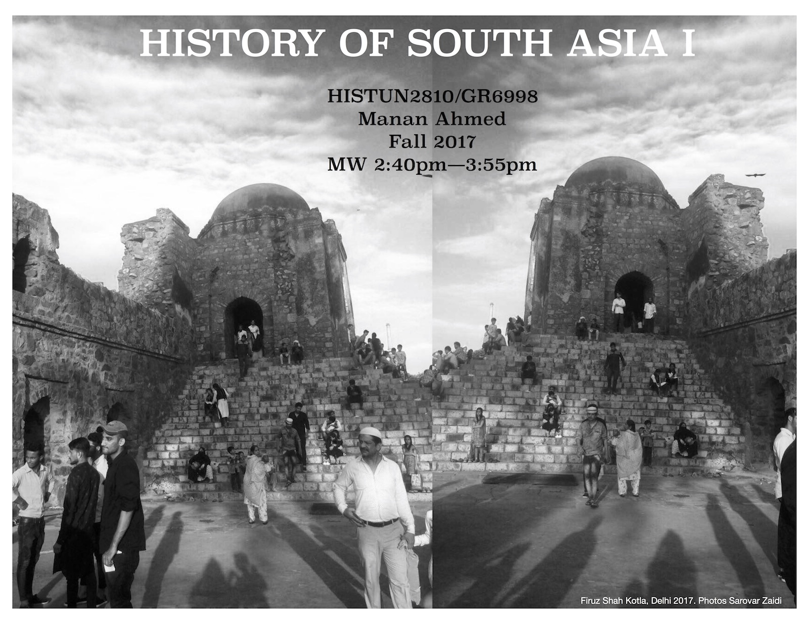

# History of South Asia I

## Course Objectives
There are three broad objectives to the course: First, to gain a fuller comprehension of the political, social and cultural history of the sub-continent from  3 CE to 1400 CE. Second, to delve into primary source materials (epigraphic, monumental, textual ) pertaining to crucial themes and sites from this history, in order to gain an appreciation of the transculturation processes through which varied communities organized themselves. Third, to familiarize oneself with dominant historiographical trends in the study of South Asia– particularly reflecting on ways in which early and medieval periods are understood. This is a history class, and our effort will be to act and acquaint ourselves as a historian-- the focus will be to engage productively with primary sources, historiography, and produce analytical pieces of writings.

## Course Texts
* Richard Eaton. *A Social History of the Deccan, 1300-1761: Eight Indian Lives*. Cambridge: Cambridge University Press, 2008 
* Aditya Behl. *The Magic Doe: Qutban Suhravardi’s Mirigavati*. New York: Oxford University Press, 2011
* Qurutalain Hyder, *River of Fire*. New Directions Publishing, 2003

## Course Description
South Asia is defined in the academic realm as stretching from Afghanistan to Burma-- a land mass roughly equivalent to 60% of the land mass of United States but with nearly five times the population, which is ethnically, linguistically and religiously heterogenous. Given this diversity, and the scope of civilizational presences reaching back to many thousands years BCE, it is futile to assert continuities. Rather, we can understand that across this geographic realm, continue through time, processes which are multi-layered, complex and within which history and memory remain in constant flux.  

We have a very limited, highly prejudiced, imagination when it comes to comprehending the premodern in South Asia. This is so because our evidences are often fragmentary, malleable or encoded in political and social tropes that are overtly determined. But the fault doesn’t lie there. It lies, I would argue, in our overtly presentist vocabulary within which we chose to frame the past. The words we use, informed by our immediate past, are already encoded with incomprehensible difference – coercion , submission , conversion , conflict . The categories we construct are already hegemonic – “Hindu,” “Muslim,” “invader,” “native.” We take these ahistoricized words and categories and proceed to give them universality that they don’t deserve even for the here and the now. What is produced are deeply pessimistic formulations, of clashes and conquests, which suggest only intractable fault lines etched into the sites and spaces of South Asia. 

Instead of focusing on entrenchments, our course will focus on processes and networks of transmissions--  imperial formations, transculturation, movement of goods and people, circulation of narratives-- and the political and social worlds which are formed, contested and re-imagined through them. 

The course is arranged in six thematic sections-- within each section, we will cover material in a chronological fashion. This has the advantage of removing chronology as the predominant mode of analysis and it will give the class cohesion beyond the "this happened and then that happened" and "it all happened somewhere far away". The themes of power, structural difference, gender and agency that permeate these section will allow us to link medieval South Asia to our contemporary lives in NY.

>**I: Theories of Kingship**: Two key concerns will orient us: Regionalism and Kingship. The political polities we will cover include: Gupta, Chola, Gurjara Patihara, Rashtrakuta, Chalukya, Arab Sindh, Ghaznavid, Delhi Sultanate, Deccani Sultanates. The concepts of Chakravartin, Rajaya, Khalifa, Sultan,  would lead us to think about claims to political legitimacy and political theory.

>**II: Sacral Geography**: This section will cover the emergence of cities, the development of pilgrimage and trade routes, and the ways in which temples, markets and ports appear as markers of civitas and habitus. We will cover the Rome-Indic Trade, the Silk Route, the pilgrimage routes connecting Bengal and Kashmir, Multan and Madurai. 

>**III. Political Theory**: This section will cover the ways in which various political entities made sense of their particular claim to governance across regnal, sacral, cultural and political landscapes. Our main concepts will be Monumentalism, Body, Courtly Culture, and Sacral Communities.

>**IV: Transculturation**: This section will look at ways in which the various communities (elite or subaltern) shaped their own selves and their others in a dialogue. We will read works of Sufi and Bhakti traditions and examine what "conversion" in medieval South Asia looked like.

>**V: Literary Cultures**: The section will focus on the role of literary culture-- the ways in which language, script, texts, and narratives shape the social, cultural and political self . 

>**VI: Historical Memory**: Our last section will look at the presence of this long past in contemporary and near-contemporary moments and examine how a  particular past is used to explain, uncritically, or to justify, unambiguously, that which is left unexamined and unassimilated in the present. 

## Class Policies
* Attendance is required, necessary and crucial for successful completion of the course. Unexcused absences beyond one will result in grade devaluation, as will consistent late arrivals or disruptions. Participation is 20% of your grade - it is defined as consistent and constant presence in the course (including TA session), engagement with the materials and your colleagues.
* Academic integrity is a basic understanding of our engagement in this course. I make a commitment to engage ethically and honestly with you, and I expect the same commitment. Plagiarism or dishonesty and unethical behavior is unacceptable and you will face punitive measures.  You can learn more about Columbia’s official policies on Academic honesty, plagiarism, as well as citational practices here: http://www.college.columbia.edu/academics/integrity
* Classroom Etiquette are best practices of your academic and social lives: be considerate in class; arrive before official class time; listen well; interact with your colleagues with respect and compassion; turn off your phone; and turn off your computing devices. One basic goal of this class is to learn through careful reading and discussion of primary texts, you are required to bring copies of all assigned works to class to facilitate discussion during class session. You will be expected to constantly “read around” the material, looking up key terms and people in encyclopedias, dictionaries, articles, and other references - to situate your own knowledge within the class.
* Student with documented disabilities who may need academic accommodation, should let me know. 

## Assessments
* Written Assignments count for 40% of your grade. You are required to write a response to the primary readings for that session of no more than 400-500 words. Your response should cover your analytical, close reading of the text as modeled in the class-- focus specifically on the subjectivity embedded in the source, the intended audience and the imagined social function. You can use any of the interpretive concepts covered in the class. Over the course of the semester, you will write eight (8) such responses. 
* Exams count for 40% of your grade. There will be two map quizzes and two take home Annotation exercises. 
* Participation, in class and outside class is 20% of your grade. A large section of the time, once a week, will be focused on discussion and I urge you to participate fully. You can visit an exhibit of medieval South Asia (at The Met or other galleries in NYC) or you can attend a talk on medieval South Asia. A one page reflection and documentation of either is required for you to receive your participation grade.

## Course Readings

### Primary Texts

* Ashokan Edicts (c. 300 BCE)
* Kautilya, *Arthashastra* (3 CE)
* Kalidasa, *Cloud Messenger* (c. 400 CE)
* Inscription from Navsari Plates of Pulakesiraja (c. 740-50)
* Bhavabhūti (8th c), *Uttararāmacarita*
* Nizam ul Mulk, *Siyasatnama* (10th c)
* Beyhaqi, *Tari'kh* (11th c.)
* Aal-Biruni, *Kitāb fī Taḥqīq mā lil-Hind* (11th c)
* *Vikramacholanula* (12th C.)
* Lakhapadhati Documents (13th C)
* Inscriptions from the “Staff of Firuz Shah” (14th c)
* Ibn Batutta, *Rihla* (14th c)
* Anand Patwardan, *Raam kay Naam* (20th c)

### Secondary Scholarship
>I want to acknowledge the stark gender disparity in the secondary readings which is a reflection of the status of the field. I have done my best as well to have you read scholars from the US, UK, and South Asian academies.

* Muzaffar Alam. *Languages of Political Islam: India 1200-1800* (London: Hurst & Co. 2004): 85-98, 115-122.
* Daud Ali. *Courtly Culture and Political Life in Early Medieval India.* (Cambridge: Cambridge University Press, 2004): 1-32
* Manan Ahmed Asif, "Demon with Ruby Eyes", *A Book of Conquest* (Cambridge, MA: Harvard University Press, 2016): 103-127
* Shadab Bano, “Women Slaves in Medieval India” *Proceedings of the Indian History Congress*, Vol. 65 (2004), 314-323
* Simon Digby, “Sufi Shaykh and Sultan: A Conflict of Claims to Authority in Medieval India,” *Iran* vol. 28, (1990): 71-81
*  Vinay Dharwadkar, "Censoring the Ramayana", *PMLA* 127.3 (May 20, 2012): 433-50
* Carl W. Ernst, “Situating Sufism and Yoga”, *Journal of the Royal Asiatic Society*, 15:1 (Apr., 2005): 15-43
* Benjamin J. Fleming, “Mapping Sacred Geography in Medieval India: The Case of the Twelve "Jyotirliṅgas"”, *International Journal of Hindu Studies* , 13:1  (Apr., 2009), 51-81
* Finbarr B. Flood. *Objects of Translation: Material Culture and Medieval ‘Hindu– Muslim’ Encounter* (New Delhi: Permanent Black, 2010): 1-35
* Alyssa Gabbay, “In Reality a Woman: Sultan Iltutmish, His Daughter, Raziya, and Gender Ambiguity in Thirteenth Century Northern India”, *Journal of Persianate Studies* 4 (2011), 45-63
* Irfan Habib, "The Formation of India: Notes on the History of an Idea", Social Scientist, vol 25, no. 7/8 (July 1997): 3-10
* James Heitzman, "Ritual Polity and Economy: The Transactional Network of an Imperial Temple in Medieval South India", *Journal of the Economic and Social History of the Orient* 34:1/2 (1991): 23-54
* Ronald Inden, Hierarchies of Kings in Medieval India, *Texts and Practice: Essays on South Asian History* (London: Oxford University Press, 2004): 129-159
* Anne KS Lambton, "Concept of Authority", *Iran*, 26 (1988): 95-103
* Brandon LeRoque, “Mahamat Prannath and the Pranami Movement: Hinduism and Islam in the Service of a Mercantile Sect”, *Religious Interactions in Mughal India*, (London: Oxford University Press, 2014): 343-378
* David Ludden. *India and South Asia: A Short History* (New York: OneWorld Publishers, 2006): 1-33
* Satya P. Mohanty, “Alternative Modernities and Medieval Indian Literature: The Oriya "Lakshmi Purana" as Radical Pedagogy” *Diacritics*, Vol. 38, No. 3 (Fall, 2008), 3-15, 17-21
* Sheldon Pollock, "The Sanskrit Cosmopolis, 300-1300: Transculturation,  Vernacularization, and the Question of Ideology," *Ideology and Status of Sanskrit*, ed. Jan E. M. Houben (Leiden: Brill, 1996): 197-247
* Tahera Qutbuddin, “Arabic in India: A Survey and Classification of Its Uses, Compared with Persian” *Journal of the American Oriental Society*, 127:3 (Jul. - Sep., 2007): 315-338
* V. N. Rao, “Multiple Literary Cutures in Telugu: Court, Temple, and Public” in Sheldon Pollock (ed.) *Literary Cultures in History: Reconstructions from South Asia* (Berkeley: University of California Press, 2003): 383-437
* A.K. Ramanujan, "Three Hundred Ramayanas: Five Examples and Three Thoughts on Translation", *The Collected Essays of A.K. Ramanujan* (London: Oxford University Press: 2004): 131-161
* Sumathi Ramaswamy, “Language of the People in the World of Gods: Ideologies of Tamil before the Nation”, *The Journal of Asian Studies*, 57:1 (Feb., 1998): 66-92
* Himanshu Prabha Ray, "The Artisan and the Merchant in Early Gujarat" *Ars Orientalis*, 34 (2004): 39-61
* Nilanjan Sarkar, “Forbidden Privileges and History-Writing in Medieval India”, The Medieval History Journal, 16, 1 (2013): 21–62
* Burton Stein, “Circulation and the Historical Geography of Tamil Country” *The Journal of Asian Studies*, Vol. 37, No. 1 (Nov., 1977), 7-26
* Samira Sheikh, *Forging a Region: Sultans, Traders, and Pilgrims in Gujarat, 1200-1500* (Delhi: Oxford University Press, 2010)
* Prithvi Datta Chandra Shobhi, "Kalyāṇa is Wrecked: The Remaking of a Medieval Capital in Popular Imagination", *South Asian Studies* 32:1 (2016): 90-98
* Cynthia Talbot,”Becoming Turk the Rajput Way: Conversion and Identity in an Indian Warrior Narrative” *Modern Asian Studies*, 43:1 (2009): 211-243
* Romila Thapar. *Early India* (Berkeley: University of California Press, 2002): 37-68

## Course Timeline
All Readings to be done before Class - Readings are marked by the last name of the Author and available in the Files & Resources. 

### WED SEP 6: Introductions
* Irfan Habib, "The Formation of India: Notes on the History of an Idea", 3-10

### MON SEP 11
* Romila Thapar, "Landscapes and Peoples", 37-68
* David Ludden, "India and South Asia", 1-33

### WED SEP 13: Kingship
* Ronald Inden, "Hierarchies of Kings in Medieval India", 129-159
* Anne KS Lambton, "Concept of Authority", 95-103

### MON SEP 18: Kingship
* (PS) Kautilya, Arthashastra
* (PS) Nizam ul Mulk, Siyasatnama 

### WED SEP 20: Kingship
* Richard Eaton, "Partapa Rudra", 9-32
* Primary Reading Paper 1 (on Arthashastra or Siyastnama)

### MON SEP 25: Sacral Geography
* (PS) Kalidasa, *Cloud Messenger*
* (PS) *Vikramacholanula*
* FIRST MAP QUIZ

### WED SEP 27: Sacral Geography
* Samira Sheikh, "Regions of Gujarat", 25-61
* Himanshu Prabha Ray, "The Artisan and the Merchant in Early Gujarat", 39-61.
* Response Paper 2 (on Cloud Messenger)

### MON OCT 2: Sacral Geography
* Benjamin Fleming, "Sacred Geography", 51-81
* Burton Stein, “Circulation and the Historical Geography of Tamil Country”, 7-26

### WED OCT 4: Sacral Geography
* Richard Eaton, "Gisu Daraz", 33-59
* (PS) Ibn Battuta, *Rihla*
* Response Paper 3 (on Ibn Batutta)

### MON OCT 9: Political Theory
* (PS) Beyhaqi, History
* James Heitzman, "Ritual Polity and Economy", 23-54
* Simon Digby, "Sufi Sheikh and Sultan", 71-81

### WED OCT 11: Political Theory
* Daud Ali, "Courtly Culture and Political Life in Early Medieval India", 1-32.
* Manan Ahmed Asif, “A Demon with Ruby Eyes”, 103-127
* Response Paper 4 (on Beyhaqi)

### MON OCT 16: Political Theory
* (PS) Inscriptions from the “Staff of Firuz Shah”
* Richard Eaton, "Rama Raya", 78-105, "Malik Ambar", 105-129
* SECOND MAP QUIZ

### WED OCT 18: Political Theory
* Nilanjan Sarkar, “Forbidden Privileges and History-Writing in Medieval India”, 21–62
* Alyssa Gabbay, “In Reality a Woman”, 45-63

### MON OCT 23: Political Theory
* Shadab Bano, “Women Slaves in Medieval India”, 314-323
* (PS) Lakhapadhati
* Cynthia Talbot,”Becoming Turk the Rajput Way” , 211-243

### WED OCT 25: Transculturation
* Finbarr Flood, *Objects in Translation*, 1-27
* Carl Ernst, "Situating Sufism and Yoga", 15-43
* Response Paper 5 (on Lakhapadhati)

### MON OCT 30: Transculturation
* Richard Eaton, "Tukaram", 129-155
* Brandon LeRoque, “Mahamat Prannath and the Pranami Movement", 343-378
* Annotation Exercise 1

### WED NOV 1: Transculturation
* (PS) The Magic Doe: Qutban Suhravardi’s Mirigavati, 39-129.

### WED NOV 8: Transculturation
* (PS) The Magic Doe: Qutban Suhravardi’s Mirigavati, 129-195, xx-4xx
* Response Paper 6 (on Mirigavati)

### MON NOV 13: Literary Cultures
* Sheldon Pollock, "The Sanskrit Cosmopolis, 300-130", 197-247
* Sumathi Ramaswamy, “Language of the People in the World of Gods", 66-92

### WED NOV 15: Literary Cultures
* Muzaffar Alam, "Language and Power", 115-140
* Tahera Qutbuddin, “Arabic in India", 315-338

### MON NOV 20: Literary Culture
* (PS) Shulman & Rao, Classical Telegu Poetry
* V. N. Rao, “Multiple Literary Cutures in Telugu”, 383-437

### WED NOV 22: Literary Culture
* Satya P. Mohanty, “Alternative Modernities and Medieval Indian Literature", 3-15, 17-21
* Response Paper 7 (on Telegu Poetry)

### MON NOV 27: Historical Memory
* AK Ramanujan, "Three Hundred Ramayanas", 131-161
* Vinay Dharwadkar, "Censoring the Ramayana", 433-450

### WED NOV 29: Historical Memory
* Prithvi Datta Chandra Shobhi, "Kalyāṇa is Wrecked", 90-98
* Response Paper 8 (on Ram ke Naam)

### MON DEC 4: Historical Memory
* Qurutalain Hyder, *River of Fire*, 1- 105

### WED DEC 6: Historical Memory
* Qurutalain Hyder, *River of Fire*, 105 - 213
* Annotation Exercise 2

### MON DEC 11
* Conclusions
