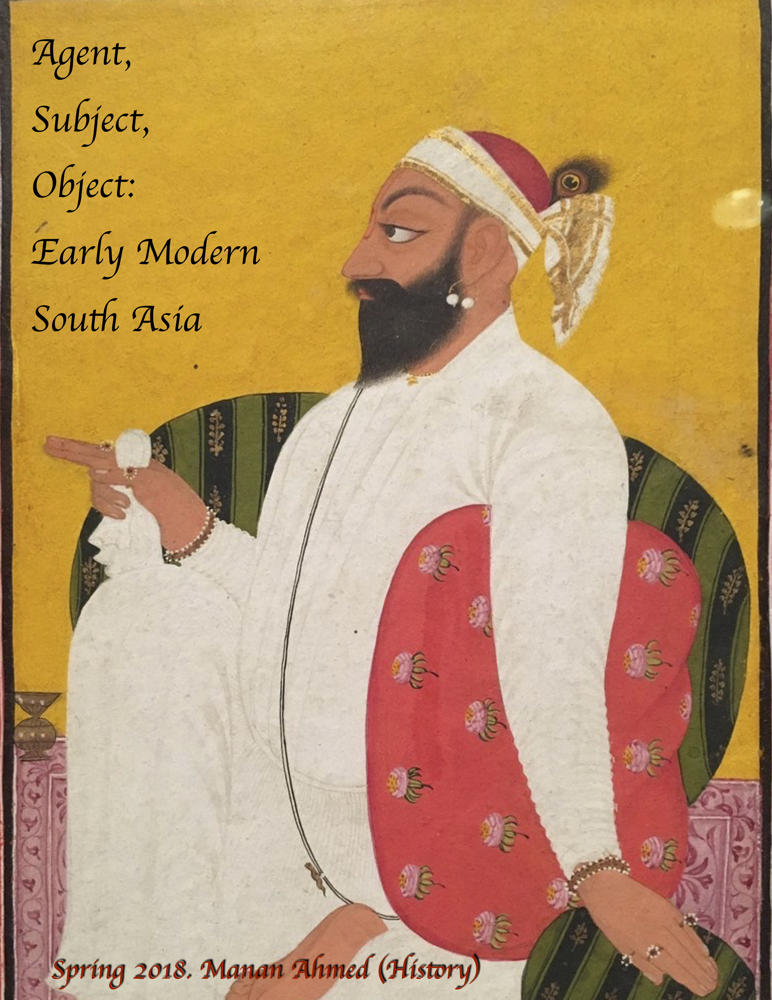

# Agent, Subject, Object: Early Modern South Asia

## Course Description
This graduate seminar focuses on subject, objects and agents that catalyzed the material and political orders from 1500-1800 in South Asia. We pair primary, historical texts (in translation) with recent monographs which demonstrate the intersections between text, narrative and polity. Our guiding interests will be in understanding the intimate relationship between power and agency and objects within specific political spaces. Eschewing the center/periphery models, we will focus on specific sites of literary and political imagination- Bengal, Deccan, Punjab—and the turn to the global connections with America and Europe during this period. This seminar will assume broad familiarity with both Indian and European early modern politics and thought.

## Course Readings (in order of assignment)
* Kumkum Chatterjee. *The Cultures of History in Early Modern India: Persianization and Mughal Culture in Bengal* (New York: Oxford University Press, 2009) 
* Kavikankan Mukundaram Chakravarti. *Chandimangal*. Edward M. Yazijian (tr.) (New Delhi: Penguin Classics, 2015)
* Valerie Stoker. *Polemics and Patronage in the City of Victory: Vyasatirtha, Hindu Sectarianism, and the Sixteenth-Century Vijayanagara Court* (Berkeley, CA: University of California Press, 2016)
* Allasani Peddana. *The Story of Manu*. Velcheru Narayana Rao and David Shulman (tr) (Cambridge, MA: Murty Classical Library of India, 2015)
* Purnima Dhavan. *When Sparrows Became Hawks: The Making of the Sikh Warrior Tradition, 1699-1799* (New York: Oxford University Press, 2011)
* W. H. McLeod. *The Chaupa Singh Rahit-nama* (Dunedin: University of Otago Press, 1987)
* Sanjay Subrahmanyam. *Europe’s India: Words, People, Empires, 1500–1800* (Harvard University Press, 2016)
* Jonathan Eacott. *Selling Empire: India in the Making of Britain and America, 1600-1830* (Charlotte, NC: University of North Carolina Press, 2017) 

## Class Expectations

> The class is designed as a graduate-level discussion seminar, designed to explore latest historiography on early modern South Asia. Doing full and complete assigned reading plus any further research to understand the historiography or theory is an understood part of participation in the class. You are also expected to be participate as peers and colleagues and respect both the intellectual and social space of the seminar room.

* Primary Source Lead Discussion & Essay: 25%
* Monograph Lead Discussion & Essay: 25%
* Piazza discussions: 25%
* Visual Culture Essay: 25%

## Class Schedule

* Wed Jan 17—Introductions & Overview of the Course. Readings TBA
* Wed Jan 24--Chatterjee
* Wed Jan 31—Chakravarti 
* Wed Feb 7—Chatterjee & Chakravarti
* Wed Feb 14-- Stoker
* Wed Feb 21— Peddana
* Wed Feb 28— Stoker & Peddana
* Wed Mar 7-- Dhavan
* Wed Mar 21— McLeod
* Wed Mar 28-- Dhavan & McLeod 
* Wed Apr 4-- Subhramanyam
* Wed Apr 11-- Subhramanyam
* Wed Apr 18-- Eacott
* Wed Apr 25-- Eacott
