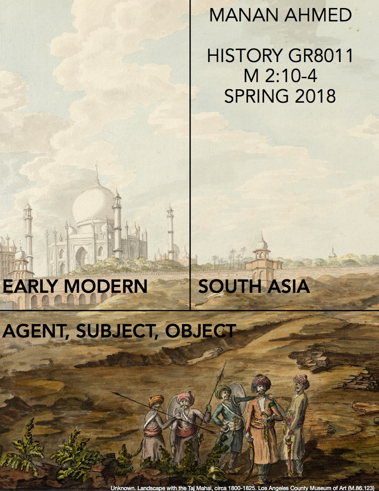

# Agent, Subject, Object: Early Modern South Asia

## Course Description
This graduate seminar focuses on agents, subjects and objects that catalyzed the material and political orders from 1500-1800 in South Asia. We pair primary, historical texts (in translation) with recent monographs which demonstrate the intersections between narrative and polity within material and epistemic realms. Our guiding interests will be in understanding the intimate relationship between power, agency and materiality within specific political spaces. Eschewing the center/periphery models, we will focus on specific sites of literary and political imagination-- Bengal, Deccan, Punjab—- and then turn to the global connections with America and Europe during this period. This seminar will assume broad familiarity with European early modern politics and thought.

## Required Pre-Seminar Readings on Agency, Subjectivity and Material Culture

* Butler, Judith. *Psychic Life of Power: Theories in Subjection*. Stanford: Stanford University Press, 1997, pp. 1-31, 132-167.
* Inden, Ronald. *Human Agency in the Social Sciences* (London & Chicago: Criticalia, 2014)
* Jean Baudrillard, “The System of Collecting” (1968) in John Elsner and Roger Cardinal, eds., *The Cultures of Collecting* (Harvard University Press, 1994), pp. 7-24
* Michel Foucault, *The Order of Things: An Archaeology of the Human Sciences* (1966; Vintage, 1994), chap. 5

## Course Readings (in order of assignment)
* Kumkum Chatterjee. *The Cultures of History in Early Modern India: Persianization and Mughal Culture in Bengal* (New York: Oxford University Press, 2009) 
* Kavikankan Mukundaram Chakravarti. *Chandimangal*. Edward M. Yazijian (tr.) (New Delhi: Penguin Classics, 2015)
* Valerie Stoker. *Polemics and Patronage in the City of Victory: Vyasatirtha, Hindu Sectarianism, and the Sixteenth-Century Vijayanagara Court* (Berkeley, CA: University of California Press, 2016)
* Allasani Peddana. *The Story of Manu*. Velcheru Narayana Rao and David Shulman (tr) (Cambridge, MA: Murty Classical Library of India, 2015)
* Purnima Dhavan. *When Sparrows Became Hawks: The Making of the Sikh Warrior Tradition, 1699-1799* (New York: Oxford University Press, 2011)
* W. H. McLeod. *The Chaupa Singh Rahit-nama* (Dunedin: University of Otago Press, 1987)
* Sanjay Subrahmanyam. *Europe’s India: Words, People, Empires, 1500–1800* (Harvard University Press, 2016)
* Jonathan Eacott. *Selling Empire: India in the Making of Britain and America, 1600-1830* (Charlotte, NC: University of North Carolina Press, 2017) 

## Class Expectations

> The class is designed as a graduate-level discussion seminar to explore latest historiography on early modern South Asia. Doing full and complete assigned readings, plus any further research to understand the historiography or theory, is necessary for full participation in the class. You are also expected to act respectfully and with an open disposition with your peers and colleagues. You should respect both the intellectual and social space of the seminar room.

* Primary Source Essay & In-class Presentation (2000 words) : 25%
* Monograph Essay & In-class Presentation (2000 words): 25%
* Piazza discussions: 25%
* Visual Culture Essay ([example](http://www.oarplatform.com/response/cartography-research-process-visual-essay/)): 25%

## Class Schedule

* Wed Jan 17—Introductions & Overview of the Course. Readings TBA
* Wed Jan 24--Chatterjee
* Wed Jan 31—Chakravarti 
* Wed Feb 7—Chatterjee & Chakravarti (presentations)
* Wed Feb 14-- Stoker
* Wed Feb 21— Peddana
* Wed Feb 28— Stoker & Peddana  (presentations)
* Wed Mar 7-- Dhavan
* Wed Mar 21— McLeod
* Wed Mar 28-- Dhavan & McLeod  (presentations)
* Wed Apr 4-- Subhramanyam
* Wed Apr 11-- Eacott  
* Wed Apr 18-- Subrahmanyam & Eacott  (presentations)
* Wed Apr 25-- Conclusions
