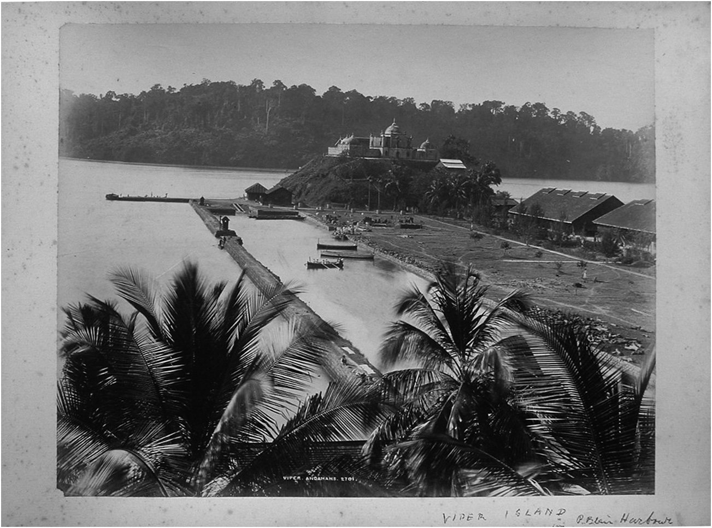

# History 8495: Borderlands History

### Professors Manan Ahmed and Karl Jacoby
### Fall 2022

### Course Description:

Although questions of national expansion and boundary creation were fundamental to the work of such leading nineteenth-century historians as Francis Parkman and Frederick Jackson Turner, only in recent years have these topics recaptured the historical imagination.  Scholars operating under the rubric of “borderlands history” have found the complex racial composition, forbidding yet fragile environment, wars of conquest, boom and bust development, and rapid urbanization of border regions around the world to be fertile terrain for a wide range of fresh approaches to the past.  No longer marginal regions relegated the periphery of historical analysis, the borderlands have instead emerged in this new literature as central to any effort to grapple with notions of empire and imperialism, the contingent nature of state building and of race, and with transnational and comparative units of historical analysis.

### Expectations:

The class is designed as a graduate-level discussion seminar, designed to explore the emerging field of borderlands history in North America and South Asia.  Over the semester, students will be expected to complete three assignments, two written and one oral.

* Write responses to the weekly readings on EdDiscussions—posted the day before class prior to 10 PM. These responses should cover the readings and aim to highlight theoretical and methodological themes that resonated with you. Feel free to comment and engage with your peers and their responses—especially where thematic overlaps emerge.

* Co-Lead, with a partner, a classroom discussion of a historical map or a primary source relating to a particular week’s set of readings.  Post your discussion questions to Piazza a day before the class.  This presentation should be no longer than 12 minutes.

* Write a review essay comparing two of the books that we read this semester (approximately 3,000 words).  This essay is due on or before December 11.

It is expected that all students will conduct themselves with a spirit of lively yet tolerant exchange, in which disagreements are welcomed yet treated with respect.  Since discussion is central to the seminar format, it is essential that all students come to class having completed the assigned reading.  Prompt, regular attendance is expected of all class participants.  Please turn off laptops and cell phones for the duration of the class.

### Grades:
Marks will be determined according to in-class participation and written assignments.

	* Participation: 25%
	* Leading discussion (paired): 25%
	* Postings on EdDiscussions: 25%
	* Comparative essay: 25%

### Academic Integrity:

Cheating and plagiarism will not be tolerated under any circumstances.  Should students have any question as to what constitutes appropriate academic behavior, they are encouraged to consult with the professor and to revisit the Faculty Statement on Academic Integrity below:

>The intellectual venture in which we are all engaged requires of faculty and students alike the highest level of personal and academic integrity.  As members of an academic community, each one of us bears the responsibility to participate in scholarly discourse and research in a manner characterized by intellectual honesty and scholarly integrity.
>cholarship, by its very nature, is an iterative process, with ideas and insights building one upon the other.  Collaborative scholarship requires the study of other scholars’ work, the free discussion of such work, and the explicit acknowledgement of those ideas in any work that inform our own.  This exchange of ideas relies upon a mutual trust that sources, opinions, facts, and insights will be properly noted and carefully credited.
>In practical terms, this means that, as students, you must be responsible for the full citations of others’ ideas in all of your research papers and projects; you must be scrupulously honest when taking your examinations; you must always submit your own work and not that of another student, scholar, or internet agent.

Any breach of this intellectual responsibility is a breach of faith with the rest of our academic community.  It undermines our shared intellectual culture, and it cannot be tolerated.  Students failing to meet these responsibilities should anticipate being asked to leave Columbia.

## Indigenous Land Acknowledgment:

At Columbia's Morningside campus, we acknowledge that we are on the territory of the Lenape and Wappinger peoples.  Many indigenous communities have lived in and moved through this place over time.  Indigenous people from many nations live and work in this region today.  We acknowledge their communities by paying respect to their elders past and present, and recognizing their active presence and their futurity, reposed in the generations present and those to come.

### Readings:

All assigned books are available at Book Culture (536 West 112th Street).  All assigned articles have been uploaded to Canvas.

Books at Book Culture:

* Bathsheba Demuth, [Floating Coast:  An Environmental History of the Bering Strait](https://wwnorton.com/books/9780393635164) (W.W.Norton, 2020)
* George Díaz, [Border Contraband: A History of Smuggling across the Rio Grande](https://utpress.utexas.edu/books/diaz-border-contraband) (University of Texas Press, 2015)
* Karl Jacoby, [The Strange Career of William Ellis: The Texas Slave Who Became a Mexican Millionaire](https://wwnorton.com/books/The-Strange-Career-of-William-Ellis/) (W.W.Norton, 2017)
* Samia Khatun, [Australianama: The South Asian Odyssey in Australia](https://www.hurstpublishers.com/book/australianama/) (Hurst Publishers, 2018)
* Kelly Lytle-Hernandez, [City of Inmates: Conquest, Rebellion, and the Rise of Human Caging in Los Angeles](https://uncpress.org/book/9781469631189/city-of-inmates/), 1771–1965 (UNC Press, 2017)
* Monica Martinez, [The Injustice Never Leaves You: Anti-Mexican Violence in Texas](https://www.hup.harvard.edu/catalog.php?isbn=9780674976436) (Harvard University Press, 2018)
* Américo Paredes, [With His Pistol in His Hand: A Border Ballad and Its Hero](https://utpress.utexas.edu/books/parpis) (University of Texas Press, 1958)
* Ronald Rael, [Borderwall as Architecture: A Manifesto for the U.S.-Mexico Boundary](https://www.ucpress.edu/book/9780520283947/borderwall-as-architecture) (University of California Press, 2019)
* Sujit Sivasundaram, [Waves Across the South: A New History of Revolution and Empire](https://press.uchicago.edu/ucp/books/book/chicago/W/bo108116105.html) (University of Chicago Press, 2021
* Malini Sur, [Jungle Passports: Fences, Mobility, and Citizenship at the Northeast India-Bangladesh Border](https://www.pennpress.org/9780812224788/jungle-passports/), (University of Pennsylvania Press, 2021)
* Eric Tagliacozzo, [In Asian Waters: Oceanic Worlds from Yemen to Yokohama](https://press.princeton.edu/books/hardcover/9780691146829/in-asian-waters) (Princeton University Press, 2022)
* Suchitra Vajayan, [Midnight’s Borders: A People's History of Modern India](https://www.mhpbooks.com/books/midnights-borders/) (Melville House, 2021)

## Class Schedule:

### September 6: Manifesto Destiny

* Frederick Jackson Turner, “The Significance of the Frontier in American History” (1893) [Canvas]
* Lord Curzon, “Frontiers” (1907) [Canvas]
* Herbert E. Bolton, “The Epic of Greater America” *American Historical Review* 38:3 (April 1933): 448-474 [Canvas]
* Gloria Anzaldua, “The Homeland, Aztlán / El otro México” [Canvas]
* Jeremy Adelman and Stephen Aron, “From Borderlands to Borders,” *American Historical Review* 104:3 (June 1999): 814-841 [Canvas]
* Alison Bashford, “Terraqueous Histories,” *The Historical Journal* 60:2 (2017): 253-272 [Canvas]
* Pekka Hämäläinen and Samuel Truett, “On Borderlands,” *Journal of American History* 98:2 (September 2011): 338-361 [Canvas]

### September 13: Foundations y Fundadores

* Américo Paredes, *With His Pistol in His Hand*, 1-247
* Pedro Castillo and Al Camarillo, Muerte y Furia: Los Bandidos Chicanos [Canvas]

### September 20:

* Sivasundaram, *Waves Across the South*, 1-360

### September 27: Beringia as Borderland

* Bathsheba Demuth, *Floating Coast*, 1-318

### October 4:

* Eric Tagliacozzo, *In Asian Waters*, 1-

### October 11: Gone to Texas I: Special Guest: Robert “Chip” Williams

* Karl Jacoby, *The Strange Career of William Ellis*, 1-204
* Primary Source: [The Strange Career of William Ellis](https://www.williamhellis.com)
* Primary Source: [Texas Runaway Slave Project](http://digital.sfasu.edu/cdm/newspapermap/collection/RSP)

### October 18:

* Malini Sur, *Jungle Passports*, 1-
* C.J. Alvarez, “Police, Waterworks, and the Construction of the U.S.-Mexico Border, 1924–1954,” *Western Historical Quarterly* 50:3 (Autumn 2019): 233-256. [Canvas]
* Primary Source: Map

### October 25: Gone to Texas II

* Monica Martinez, *The Injustice Never Leaves You*, 1-300
* Testimony of Monica Martinez Before Committee on the Judiciary [Canvas]
* Primary Source: [1919 Texas Ranger Investigation](https://www.tsl.texas.gov/treasures/law/index.html#Canales)

### November 1:

* Samia Khatun, Australianama, 1-
* Primary Source:

### November 15: Contrabando y Traición

* George Díaz, *Border Contraband*, 1-144
* Andrew Wender Cohen, “Smuggling, Globalization, and America's Outward State, 1870-1909,” *Journal of American History* 97:2 (September 2010): 371-398 [Canvas]
* Primary Source: [Strachwitz Frontera Collection of Mexican and Mexican American Recordings](http://frontera.library.ucla.edu)

### November 22: Special Guest: Suchitra Vajayan

* Suchitra Vajayan, *Midnight’s Borders*, 1-

### November 29: Carcerality

* Kelly Lytle-Hernandez, *City of Inmates: Conquest, Rebellion, and the Rise of Human Caging in Los Angeles, 1771–1965*, 1-220
* Excerpt from Yang’s Empire of Convicts?
* Primary Source: Oral Histories at Border Patrol Museum: [need a better primary source] https://www.borderpatrolmuseum.com/interviews/

### December 6: Borderlands Past, Present, and Future

* Ronald Rael, *Borderwall as Architecture*, viii-170
* Hannah Gurman, “A Collapsing Division: Border and Interior Enforcement in the U.S. Deportation System,” *American Quarterly* 69:2 (June 2017): 371-395 [Canvas]
* [Torn Apart / Separados vol 1](https://xpmethod.columbia.edu/torn-apart/volume/1/)
* Reread essays from first week of class

### December 19: Final Essays Due
