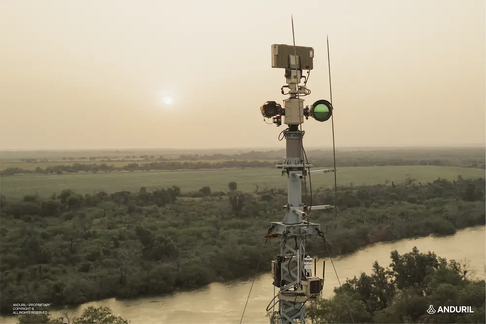

# History 8495: Borderlands History

### Professor Manan Ahmed
### Spring 2025

<figcaption>Anduril’s Extended Range Sentry Tower (XRST) autonomous system at the U.S.-Mexico border.</figcaption>

### Course Description:

Although questions of national expansion and boundary creation were fundamental to the work of such leading nineteenth-century historians as Francis Parkman and Frederick Jackson Turner, only in recent years have these topics recaptured the historical imagination.  Scholars operating under the rubric of “borderlands history” have found the complex racial composition, forbidding yet fragile environment, wars of conquest, boom and bust development, and rapid urbanization of border regions around the world to be fertile terrain for a wide range of fresh approaches to the past.  No longer marginal regions relegated the periphery of historical analysis, the borderlands have instead emerged in this new literature as central to any effort to grapple with notions of empire and imperialism, the contingent nature of state building and of race, and with transnational and comparative units of historical analysis.

### Expectations:

The class is designed as a graduate-level discussion seminar, designed to explore the emerging field of borderlands history in North America and South Asia.  Over the semester, students will be expected to complete three assignments, two written and one oral.

* Write responses to the weekly readings on EdDiscussions—posted the day before class prior to 10 PM. These responses should cover the readings and aim to highlight theoretical and methodological themes that resonated with you. Feel free to comment and engage with your peers and their responses—especially where thematic overlaps emerge.

* Co-Lead, with a partner, a classroom discussion of a historical map or a primary source relating to a particular week’s set of readings.  Post your discussion questions to Piazza a day before the class.  This presentation should be no longer than 12 minutes.

* Write a review essay comparing two of the books that we read this semester (approximately 3,000 words).  This essay is due on or before December 11.

It is expected that all students will conduct themselves with a spirit of lively yet tolerant exchange, in which disagreements are welcomed yet treated with respect.  Since discussion is central to the seminar format, it is essential that all students come to class having completed the assigned reading.  Prompt, regular attendance is expected of all class participants.  Please turn off laptops and cell phones for the duration of the class.

### Grades:
Marks will be determined according to in-class participation and written assignments.

	* Participation: 25%
	* Leading discussion (paired): 25%
	* Postings on EdDiscussions: 25%
	* Comparative essay: 25%

### Academic Integrity:

Cheating and plagiarism will not be tolerated under any circumstances.  Should students have any question as to what constitutes appropriate academic behavior, they are encouraged to consult with the professor and to revisit the Faculty Statement on Academic Integrity below:

The intellectual venture in which we are all engaged requires of faculty and students alike the highest level of personal and academic integrity.  As members of an academic community, each one of us bears the responsibility to participate in scholarly discourse and research in a manner characterized by intellectual honesty and scholarly integrity.

Scholarship, by its very nature, is an iterative process, with ideas and insights building one upon the other.  Collaborative scholarship requires the study of other scholars’ work, the free discussion of such work, and the explicit acknowledgement of those ideas in any work that inform our own.  This exchange of ideas relies upon a mutual trust that sources, opinions, facts, and insights will be properly noted and carefully credited.
In practical terms, this means that, as students, you must be responsible for the full citations of others’ ideas in all of your research papers and projects; you must be scrupulously honest when taking your examinations; you must always submit your own work and not that of another student, scholar, or internet agent.

In this class, you are required to submit your original work, properly cited, for each assignment. The usage of BARD, chatGPT or any other AI front-end to a LLM in order to generate ideas, begin or end writing assignments, clean up grammar or fill out paragraphs is prohibited.  If you need help with writing, you should visit the writing center or my office hours.

Any breach of this intellectual responsibility is a breach of faith with the rest of our academic community.  It undermines our shared intellectual culture, and it cannot be tolerated.  Students failing to meet these responsibilities should anticipate being asked to leave Columbia.

## Indigenous Land Acknowledgment:

At Columbia's Morningside campus, we acknowledge that we are on the territory of the Lenape and Wappinger peoples.  Many indigenous communities have lived in and moved through this place over time.  Indigenous people from many nations live and work in this region today.  We acknowledge their communities by paying respect to their elders past and present, and recognizing their active presence and their futurity, reposed in the generations present and those to come.

### Readings:

All assigned books are available at Book Culture (536 West 112th Street).  All assigned articles have been uploaded to Canvas.
All assigned books (with ISBNs listed) are available at Book Culture (536 West 112th Street) and on reserve at the Columbia library.  All assigned articles (and some books) have been uploaded to Courseworks. Others are available via Library/OA.

Books at Book Culture:

1. Nosheen Ali, *Delusional States: Feeling Rule and Development in Pakistan’s Northern Frontier* (Cambridge: Cambridge University Press, 2019)
2. Brett Nielsen and Sandro Mezzadra, *Border as Method, or The Multiplication of Labor* (Durham, NC: Duke University Press, 2013)
3. Jenna M. Loyd and Alison Mountz, *Boats, Borders and Bases: Race, the Cold War and the Rise of Migration Detention in the United States* (Berkeley: University of California Press, 2018) ISBN: 9780520287976
4. Ronald Rael, *Borderwall as Architecture: A Manifesto for the U.S.-Mexico Boundary* (University of California Press, 2017) ISBN: 9780520283947
5. Raffaella A. Del Sarto, *Borderlands: Europe and the Mediterranean Middle East* (Oxford University Press, 2021)
6. Sahana Ghosh, *A Thousand Tiny Cuts: Mobility and Security Across the Bangladesh-India Borderlands* (University of California Press, 2023) ISBN: 9780520395732
7. Bernadine Marie Hernández. Border Bodies: Racialized Sexuality, Sexual Capital, and Violence in the Nineteenth Century Borderlands (University of North Carolina Press, 2022)
8. Samarth Mahajan, dir., "Borderlands" (2022)
9. Stacey Philbrick Yadav, Jacob Mundy and Alexander Thurston, "Peripheries and Borderlands," *Middle East Report*, Winter 2022.
10. Jordi Tejel, Ramazan Hakkı Öztan (eds.), *Regimes of Mobility: Borders and State Formation in the Middle East, 1918-1946* (Edinburgh University Press, 2022)
11. Eyal Weizman, *Hollow Land: Israel’s Architecture of Occupation* (Verso Books, 2024). ISBN 9781804297100
12. Pamela Yates, dir., “Borderland: The Line Within” (2024)
13. Suchitra Vajayan, *Midnight’s Borders: A People's History of Modern India* (Melville House, 2021). ISBN  9781612198583

## Class Schedule:

Class Schedule:

Here are the dates for every Tuesday from January 21, 2025, until May 6, 2025:

### January 21, 2025: Manifested Borders
* Frederick Jackson Turner, “The Significance of the Frontier in American History” (1893) [Canvas]
* Lord Curzon, “Frontiers” (1907) [Canvas]
* Herbert E. Bolton, “The Epic of Greater America” *American Historical Review* 38:3 (April 1933): 448-474 [Canvas]
* Gloria Anzaldua, “The Homeland, Aztlán / El otro México” [Canvas]
* Pekka Hämäläinen and Samuel Truett, “On Borderlands,” *Journal of American History* 98:2 (September 2011): 338-361 [Canvas]
* Karma R. Chávez, "From the Mexico-U.S. Borderlands to Palestine," *Journal of Civil and Human Rights*, vol 5 (2019): 1-15

### January 28, 2025
* Sandro Mezzadra and Brett Nielsen. *Border as Method, or The Multiplication of Labor* (Durham, NC: Duke University Press, 2013)

### February 4, 2025
* Bernadine Marie Hernández. *Border Bodies: Racialized Sexuality, Sexual Capital, and Violence in the Nineteenth Century Borderlands* (University of North Carolina Press, 2022)

### February 11, 2025
* Jenna M. Loyd and Alison Mountz. *Boats, Borders and Bases: Race, the Cold War and the Rise of Migration Detention in the United States* (Berkeley: University of California Press, 2018)

### February 18, 2025
* Ronald Rael. *Borderwall as Architecture: A Manifesto for the U.S.-Mexico Boundary* (University of California Press, 2017)

### February 25, 2025
* Pamela Yates, dir., *Borderland: The Line Within* (2024)

### March 4, 2025
* Raffaella A. Del Sarto. *Borderlands: Europe and the Mediterranean Middle East* (Oxford University Press, 2021)
* Colter Thomas and Dugan Meyer, "Infrastructures of Control."

### March 11, 2025
* Jordi Tejel, Ramazan Hakkı Öztan (eds.) *Regimes of Mobility: Borders and State Formation in the Middle East, 1918-1946* (Edinburgh University Press, 2022)

### March 18, 2025: SPRING BREAK

### March 25, 2025
* Stacey Philbrick Yadav, Jacob Mundy and Alexander Thurston (eds.), "Peripheries and Borderlands," *Middle East Report*, Winter 2022

### April 1, 2025
* Eyal Weizman. *Hollow Land: Israel’s Architecture of Occupation* (Verso Books, 2024)
* OCHA Movement and Access in the West Bank | September 2024

### April 8, 2025
* Nosheen Ali. *Delusional States: Feeling Rule and Development in Pakistan’s Northern Frontier*. (Cambridge: Cambridge University Press, 2019)

### April 15, 2025
Sahana Ghosh. *A thousand tiny cuts : mobility and security across the Bangladesh-India borderlands* (University of California Press, 2023)

### April 22, 2025
* Suchitra Vajayan. *Midnight’s Borders: A People's History of Modern India* (Melville House, 2021)

### April 29, 2025
* Samarth Mahajan, dir. *Borderlands* (2022)

### May 6, 2025
* Conclusions
